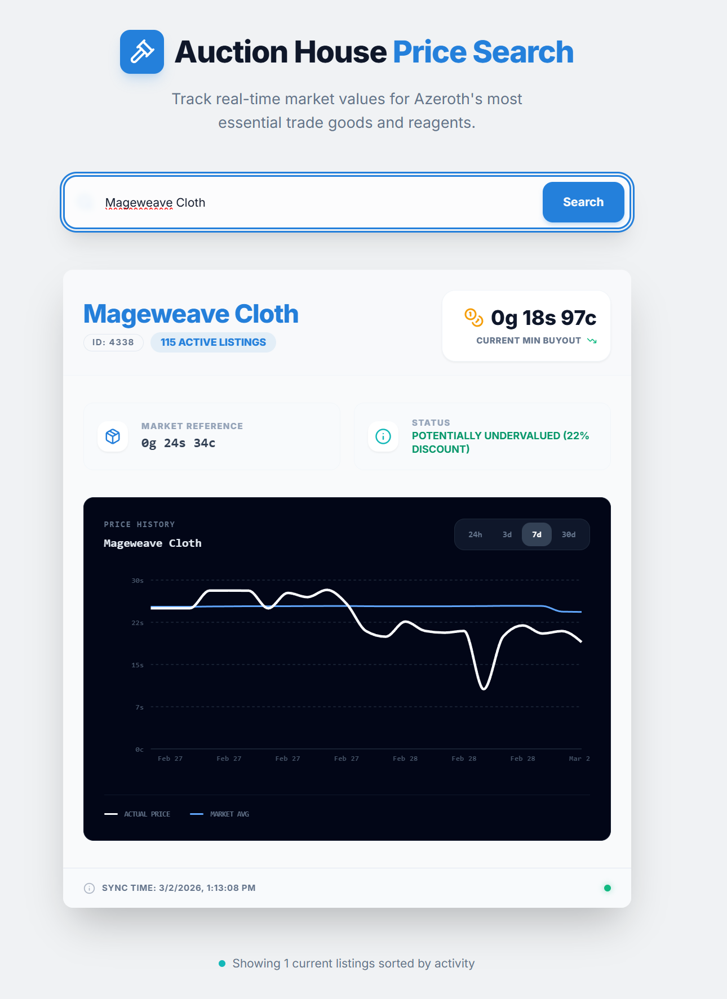

# TBC Auction Watcher

An end-to-end data engineering project that tracks World of Warcraft: The Burning Crusade Anniversary auction house prices to identify profitable buy/sell opportunities using mean reversion strategies.

Built as a portfolio project to demonstrate real-world data engineering skills: cloud-native pipeline design, automated data ingestion, analytical SQL, and full-stack deployment.

**[🔗 Live App →](https://studio--studio-5386290856-bc46e.us-central1.hosted.app)**

---

## What It Does

The app lets you search any item on the DreamScythe TBC server, view its full price history, and see a statistical buy signal when the current price drops significantly below its recent average.



---

## Architecture

```
TSM API
   │
   ▼
Cloud Scheduler (hourly cron)
   │
   ▼
Cloud Run Job (fetcher.py)
   │  - Authenticates via OAuth2
   │  - Fetches all AH data
   │  - Writes timestamped NDJSON to GCS
   │
   ▼
Google Cloud Storage (data lake)
   │  - Raw snapshots at ah_snapshots/{timestamp}.ndjson
   │
   ▼
BigQuery (data warehouse)
   │  - Append-only loads, schema autodetect
   │  - Rolling window statistics via SQL window functions
   │
   ▼
FastAPI (Cloud Run)        →        Next.js (Firebase Hosting)
      - Item search                    - Price history charts
      - Price history + signals        - Buy signal visualization
```

**Stack:** Python · FastAPI · BigQuery · Google Cloud Storage · Cloud Run · Cloud Scheduler · Firebase · Docker

---

## Key Technical Decisions

**Cloud Scheduler + Cloud Run Jobs over Airflow**
An earlier version used Apache Airflow running locally via Docker Compose. While Airflow is the industry standard for complex pipelines, it was unnecessary for a single hourly job and required keeping a local machine running 24/7. Migrating to Cloud Scheduler triggering a containerized Cloud Run Job eliminated the always-on compute while keeping the pipeline fully automated and observable in GCP.

**GCS as a raw data lake before BigQuery**
Raw NDJSON snapshots are stored in Cloud Storage before loading into BigQuery, rather than writing directly to BigQuery. This preserves a full historical record of every API response, allows for schema-on-read flexibility, and mirrors how production data pipelines are built. The raw data is immutable, transformations are layered on top.

**Mean reversion as the trading signal**
Price signals are computed using a 24-snapshot (~24 hour) rolling mean and standard deviation via BigQuery window functions. A buy signal fires when the current `minBuyout` falls more than one standard deviation below the rolling mean, indicating a temporary price dip likely to recover.

**Parameterized SQL queries**
All BigQuery queries use `ScalarQueryParameter` rather than string interpolation, preventing SQL injection and following production best practices for user-facing APIs.

---

## SQL: Rolling Statistics for Buy Signals

```sql
SELECT
    rd.snapshot_time,
    rd.minBuyout,
    rd.marketValue,
    rd.numAuctions,
    rd.quantity,
    -- 24-snapshot mean and stddev
    AVG(rd.marketValue) OVER (
        ORDER BY rd.snapshot_time
        ROWS BETWEEN 23 PRECEDING AND CURRENT ROW -- calculating mean and std from last 24 hours
    ) AS mean,
    STDDEV(rd.marketValue) OVER (
        ORDER BY rd.snapshot_time
        ROWS BETWEEN 23 PRECEDING AND CURRENT ROW
    ) AS stddev
FROM `project-f929cf6e-3eec-4c5c-85a.tsm_ah_data.raw_data` AS rd
WHERE rd.itemId = @item_id
  AND rd.snapshot_time >= TIMESTAMP_SUB(CURRENT_TIMESTAMP(), INTERVAL @days DAY)
ORDER BY rd.snapshot_time ASCC
```

---

## API Endpoints

| Method | Endpoint | Description |
|--------|----------|-------------|
| `GET` | `/item/{item_name}` | Search items by name, returns latest snapshot |
| `GET` | `/item/{item_id}/history?days=7` | Price history with rolling mean and stddev |

---

## Project Structure

```
├── main.py                        # FastAPI backend
├── Dockerfile                     # API container
├── requirements.txt
└── fetcher/
    ├── fetcher.py                 # Ingestion script (runs as Cloud Run Job)
    ├── requirements.txt
    └── Dockerfile                 # Fetcher container
```

---

## Running Locally

### Prerequisites
- Google Cloud project with BigQuery and Cloud Storage enabled
- [TradeSkillMaster](https://tradeskillmaster.com/) API key
- Application Default Credentials configured (`gcloud auth application-default login`)
  
### Environment

```bash
cp .env.example .env
# Fill in TSM_API_KEY, AH_ID, GCP_PROJECT, BUCKET_NAME
```

### Deploy the fetcher (Cloud Run Job)

```bash
gcloud builds submit --tag us-central1-docker.pkg.dev/my-project/auction-fetcher/fetcher ./fetcher

gcloud run jobs create auction-fetcher \
  --image us-central1-docker.pkg.dev/my-project/auction-fetcher/fetcher \
  --region us-central1 \
  --set-env-vars TSM_API_KEY=...,AH_ID=...,GCP_PROJECT=...,BUCKET_NAME=...
```

### Trigger the fetcher manually

```bash
gcloud run jobs execute auction-fetcher --region us-central1
```

### Deploy the API (Cloud Run Service)

```bash
gcloud builds submit --tag us-central1-docker.pkg.dev/my-project/auction-api/auction-api .

gcloud run deploy auction-api \
  --image us-central1-docker.pkg.dev/my-project/auction-api/auction-api \
  --platform managed \
  --region us-central1 \
  --allow-unauthenticated
```

> Note: The API requires data already present in BigQuery to return results. Run the fetcher job at least once before testing the API.

---

## Roadmap

- [ ] Item category filtering (cloth, herbs, minerals)
- [ ] Implement other servers' and factions' auction houses
